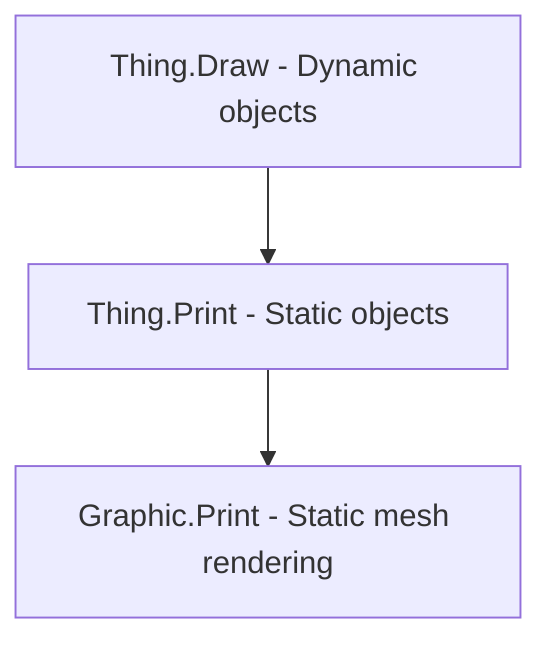

 ## 1. Main Rendering Pipeline (Dynamic Draw)

Main rendering loop for dynamic objects (`Thing`) visible by the camera. Runs for `Thing` with `def.drawerType` equal to `RealtimeOnly` or `MapMeshAndRealTime`.

```mermaid
graph TD
    A[DynamicDrawManager] -->|DrawDynamicThings()| B(Thing Cull Job System);
    B --> C{ComputeCulledThings()};
    C --> D(NativeArray&lt;ThingCullDetails&gt;);
    B -->|If !singleThreadedDrawing: Ensure Graphics Initialized (Main Thread)| E[Thing.DynamicDrawPhase(DrawPhase.EnsureInitialized)];
    E --> F(Thing.DynamicDrawPhaseAt);
    F --> G[Graphic.EnsureInitialized() / PawnRenderer.EnsureGraphicsInitialized()];
    B -->|If !singleThreadedDrawing: PreDrawVisibleThings() (Job System)| H[Thing.DynamicDrawPhase(DrawPhase.ParallelPreDraw)];
    H --> I(Thing.DynamicDrawPhaseAt);
    I --> J[PawnRenderer.ParallelPreRenderPawnAt (Compute PawnDrawParms)];
    B -->|Main Draw Loop (Main Thread)| K[Thing.DynamicDrawPhase(DrawPhase.Draw)];
    K --> L(Thing.DynamicDrawPhaseAt);
    L --> M[Thing.DrawAt / PawnRenderer.RenderPawnAt];
    M -- Thing --> N[Graphic.Draw];
    M -- Pawn --> NN[PawnRenderTree.Draw(PawnDrawParms)];
    NN --> O[... Render Nodes ...];
    N --> OOO[Graphic.DrawWorker (virtual)];
    OOO --> P[Graphic.DrawMeshInt (protected virtual)];
    P --> Q[UnityEngine.Graphics.DrawMesh (layer 0, Altitude via Y coord, Optional MPB)];
    OOO -->|If ShadowGraphic exists| R[ShadowGraphic.DrawWorker];
    R --> S[...];
    S --> T[UnityEngine.Graphics.DrawMesh (layer 0, AltitudeLayer.Shadows, MatBases.SunShadowFade)];
    B -->|If Shadow needed & !Draw| SH[PawnRenderer.RenderShadowOnlyAt];
    SH --> T;
    B -->|DrawSilhouettes() (Optional, Job System)| U[SilhouetteUtility.DrawSilhouetteJob];
    U --> V[...];
    V --> W[GenDraw.DrawMeshNowOrLater (ShaderDatabase.Silhouette, MPB)];
```

**Enumerations:**

*   **`DrawPhase`**: `EnsureInitialized`, `ParallelPreDraw`, `Draw`.
*   **`DrawerType`**: `None` (not drawn), `RealtimeOnly` (Dynamic Draw only), `MapMeshOnly` (Static Print only), `MapMeshAndRealTime` (both Dynamic and Static).

**Key Stages and Classes:**

1.  **`DynamicDrawManager`**:
    *   Registers `Thing` with `drawerType` `RealtimeOnly` or `MapMeshAndRealTime`.
    *   In `DrawDynamicThings()`:
        *   **Culling (Job):** `ComputeCulledThings()` determines visibility (`shouldDraw`), need for shadow (`shouldDrawShadow`).
        *   **EnsureInitialized (Main Thread, optional):** Calls `thing.DynamicDrawPhase(DrawPhase.EnsureInitialized)` -> `thing.DynamicDrawPhaseAt`. Base implementation calls `Graphic.EnsureInitialized()`. `Pawn` delegates to `PawnRenderer.EnsureGraphicsInitialized()`, which initializes `PawnRenderTree`.
        *   **ParallelPreDraw (Job, optional):** `PreDrawVisibleThings()` calls `thing.DynamicDrawPhase(DrawPhase.ParallelPreDraw)` -> `thing.DynamicDrawPhaseAt`. Base implementation is empty. `Pawn` delegates to `PawnRenderer.ParallelPreRenderPawnAt()`, which calculates rendering parameters (`PawnDrawParms`) and caches them for the `Draw` phase.
        *   **Draw (Main Thread):** Iterates through visible (`shouldDraw`), calls `thing.DynamicDrawPhase(DrawPhase.Draw)` -> `thing.DynamicDrawPhaseAt`.
        *   **Shadows (Main Thread):** If not `shouldDraw`, but `shouldDrawShadow`, calls `pawn.Drawer.renderer.RenderShadowOnlyAt()` (delegates to `PawnRenderer.DrawShadowInternal`).
        *   **Silhouettes (Job):** `DrawSilhouettes()` calls `SilhouetteUtility.DrawSilhouetteJob` to render silhouettes of selected objects.

2.  **`Thing`**:
    *   `DynamicDrawPhase(DrawPhase phase)`: Wrapper -> `DynamicDrawPhaseAt`.
    *   `DynamicDrawPhaseAt(DrawPhase phase, Vector3 drawLoc, bool flip)`: **Virtual**.
        *   Base: `EnsureInitialized` -> `Graphic.EnsureInitialized()`; `Draw` -> `DrawAt`; `ParallelPreDraw` -> empty.
        *   `Pawn`: Delegates all phases to `PawnRenderer`.
    *   `DrawAt(Vector3 drawLoc, bool flip)`: **Protected Virtual**. Base -> `this.Graphic.Draw(...)`. `Pawn` does not override (logic in `PawnRenderer`).

3.  **`PawnRenderer`**:
    *   `EnsureGraphicsInitialized()`: Initializes `PawnRenderTree`.
    *   `ParallelPreRenderPawnAt()`: Calculates and caches `PawnDrawParms`.
    *   `RenderPawnAt()`: Uses cached `PawnDrawParms` to call `PawnRenderTree.Draw()`, draws shadow (`DrawShadowInternal`), effects (`StanceTrackerDraw`, etc.).
    *   `RenderShadowOnlyAt()`: Draws only the shadow.
    *   `DrawShadowInternal()`: Draws the shadow (`Graphic_Shadow` or `BodyGraphic.ShadowGraphic`).

4.  **`PawnRenderTree`**:
    *   A tree of `PawnRenderNode` responsible for rendering different parts of the pawn (body, head, apparel, weapon, overlays, etc.) in the correct order and with the correct parameters.

5.  **`Graphic`**:
    *   `EnsureInitialized()`: **Virtual**. Pre-initialization (e.g., loading resources).
    *   `Draw(...)`: Wrapper -> `DrawWorker`.
    *   `DrawWorker(...)`: **Virtual**. Main logic: gets resources (`MeshAt`, `MatAt`), calculates transform, calls `DrawMeshInt`. Calls `ShadowGraphic.DrawWorker`.
    *   `DrawMeshInt(...)`: **Protected Virtual**. Base -> `UnityEngine.Graphics.DrawMesh(..., layer: 0)`. Altitude (`AltitudeLayer`) is set via the Y-coordinate of `loc`. Overridden for `MaterialPropertyBlock` (`Graphic_WithPropertyBlock`) and others.
    *   `ShadowGraphic`: Optional `Graphic_Shadow`.

6.  **`Graphic_Shadow`**:
    *   `DrawWorker(...)`: Calls `UnityEngine.Graphics.DrawMesh` with the shadow mesh, material `MatBases.SunShadowFade` (or from `ShadowData`), at altitude `AltitudeLayer.Shadows`, `layer: 0`.

7.  **`SilhouetteUtility`**:
    *   `DrawSilhouetteJob(...)`: Calls `GenDraw.DrawMeshNowOrLater` with cached mesh/material (shader `ShaderDatabase.Silhouette`) and `MaterialPropertyBlock` for color/transparency. Altitude `AltitudeLayer.Silhouettes`. MPB is cached.

**Important:**
*   Optimization via `Job System` (`Culling`, `ParallelPreDraw` for pawns, `Silhouettes`).
*   Flexibility via virtual methods (`DynamicDrawPhaseAt`, `DrawAt`, `DrawWorker`, `DrawMeshInt`, `EnsureInitialized`).
*   Object altitude is controlled by the Y-coordinate (`AltitudeLayer`), and the `layer` parameter in `Graphics.DrawMesh` is usually 0.
*   `PawnRenderer` and `PawnRenderTree` handle complex pawn rendering logic.
*   `MaterialPropertyBlock` is used for optimizing data transfer to shaders (silhouettes, some `Graphic`).

## 2. Static Rendering (`Print`)

This pipeline renders things that don't change frequently (e.g., buildings, plants, items on the ground) into static meshes associated with map sections. It's used for `Thing`s with `def.drawerType` set to `MapMeshOnly` or `MapMeshAndRealTime`. The core idea is to combine the geometry of many static things into fewer meshes, improving performance.

```mermaid
graph TD
    A[Map Component Update] -->|Marks Section Dirty| B(Section);
    B -->|Triggers Regeneration| C(SectionLayer_Things.Regenerate);
    C -->|For each valid Thing 't'| D{t.def.drawerType == MapMeshOnly or MapMeshAndRealTime?};
    D -- Yes --> E(SectionLayer_Things.TakePrintFrom(t));
    subgraph Concrete SectionLayer_Things
        E --> F(SectionLayer_ThingsGeneral.TakePrintFrom(t));
    end
    F --> G(Thing.Print(layer: SectionLayer));
    G --> H(Graphic.Print(layer, thing, extraRotation));
    H --> I{Try Texture Atlas?};
    I -- Success --> J[Get Atlas Material, UVs, VertexColor];
    I -- Failure --> K[Use Original Material];
    J --> L(Printer_Plane.PrintPlane);
    K --> L;
    L -->|Add Verts/Tris to| M(LayerSubMesh);
    C -->|After all Things| N(SectionLayer_Things.FinalizeMesh);
    subgraph Rendering
        O(MapMeshDrawer) -->|Draws Section Meshes| P(SectionLayer.DrawLayer);
        P -->|Draws SubMesh| Q(LayerSubMesh);
        Q --> R[UnityEngine.Graphics.DrawMesh];
    end

```

**Key Components and Flow:**

1.  **`Section`**: The map is divided into sections. When something changes within a section that affects static rendering (e.g., a thing is added/removed, snow level changes), the relevant `SectionLayer`s within that `Section` are marked as dirty.
2.  **`SectionLayer`**: Abstract base class for different layers within a section (terrain, things, roof, etc.). Manages `LayerSubMesh` objects.
3.  **`SectionLayer_Things`**: Abstract subclass of `SectionLayer` specifically for static things.
    *   `Regenerate()`: This method is called when the layer is marked dirty.
        *   Iterates through all cells in its `Section`.
        *   Finds `Thing`s in each cell.
        *   Filters things based on visibility (fog, snow), `drawerType` (`MapMeshOnly` or `MapMeshAndRealTime`), and position.
        *   For each valid `Thing t`, calls the abstract `TakePrintFrom(t)`.
        *   After processing all things, calls `FinalizeMesh()` which likely prepares the `LayerSubMesh` data for rendering.
4.  **`SectionLayer_ThingsGeneral`** (Example Concrete Subclass):
    *   `TakePrintFrom(Thing t)`: Implements the abstract method. Simply calls `t.Print(this)`.
5.  **Other `SectionLayer_Things` Subclasses**:
    *   Specialized layers exist, like `SectionLayer_ThingsPowerGrid` and `SectionLayer_BuildingsDamage`. They inherit the `Regenerate` loop but might use custom `TakePrintFrom` logic or call specific print methods (e.g., `Building.PrintForPowerGrid`, `SectionLayer_BuildingsDamage.PrintDamageVisualsFrom`) instead of the standard `Thing.Print`. `SectionLayer_BuildingsDamage` directly uses `Printer_Plane` to draw damage overlays.
6.  **`Thing`**:
    *   `Print(SectionLayer layer)`: **Virtual**.
    *   **Overrides**: Some subclasses like `Plant` override `Print` with complex logic (e.g., printing multiple meshes based on growth stage). `ThingWithComps` also overrides it to call `PostPrintOnto` on its components after the base print.
7.  **`ThingComp`**:
    *   `PostPrintOnto(SectionLayer layer)`: **Virtual, empty base**. Called by `ThingWithComps.Print` *after* the main graphic is printed. Allows components to add extra geometry (e.g., overlays) to the static mesh.
8.  **`Graphic`**:
    *   `Print(SectionLayer layer, Thing thing, float extraRotation)`: **Virtual**.
        *   Determines draw `size` and UV flipping (`flipUv`) based on `thing.Rotation` and graphic properties (`ShouldDrawRotated`, etc.).
        *   Adjusts `size` if multiple items share the cell (`MultipleItemsPerCellDrawn`).
        *   Calculates final `rotation` angle.
        *   Calculates `center` position (`thing.TrueCenter()` + `DrawOffset`).
        *   Gets the correct `Material mat = this.MatAt(thing.Rotation, thing)`.
        *   **Atlas Optimization:** Calls `Graphic.TryGetTextureAtlasReplacementInfo(...)`. If the thing's texture is part of a texture atlas, this retrieves the atlas material, specific UV coordinates within the atlas, and transfers the original material's color tint to `vertexColor`. This allows drawing many different things using a single atlas material draw call.
        *   Calls `Printer_Plane.PrintPlane(...)` with all calculated parameters.
        *   Calls `ShadowGraphic.Print(...)` if a shadow graphic exists.
        *   **Overrides**: Subclasses like `Graphic_Linked` (for walls, fences) and `Graphic_Cluster` (for filth) override `Print` with custom logic. `Graphic_Linked` determines connectivity and selects the appropriate atlas sub-material. `Graphic_Cluster` scatters multiple small prints randomly within the cell. `Graphic_Gas` does *not* override `Print`, meaning gases are dynamic only.
9.  **`Printer_Plane`**:
    *   `PrintPlane(SectionLayer layer, Vector3 center, Vector2 size, Material mat, float rot, bool flipUv, Vector2[] uvs, Color32[] colors, ...)`: **Static**.
        *   Retrieves the appropriate `LayerSubMesh` from the `layer` based on the `mat`. Each `LayerSubMesh` corresponds to one material draw call.
        *   Calculates the 4 vertices of the quad based on `center`, `size`, and `rot`.
        *   Adds the vertices, UVs, and colors to the `LayerSubMesh`'s data lists (`verts`, `uvs`, `colors`).
        *   Adds 2 triangles (6 indices) to the `LayerSubMesh`'s triangle list (`tris`).
10. **`LayerSubMesh`**: Holds the vertex, triangle, UV, and color data for a specific material within a `SectionLayer`.
    *   `FinalizeMesh(MeshParts parts)`: Called by `SectionLayer.FinalizeMesh()`. Transfers the collected vertex/triangle/etc. data from the `List<>`s into the actual `UnityEngine.Mesh` object, making it ready for rendering.
11. **`MapMeshDrawer`**: The central class managing map rendering.
    *   Holds the grid of `Section` objects.
    *   `MapMeshDirty(IntVec3 loc, ulong dirtyFlags, ...)`: Called by various game systems when something changes (e.g., Thing spawned/destroyed, fog updated). Sets the `dirtyFlags` on the corresponding `Section`(s).
    *   The flags (`MapMeshFlagDefOf`) include `Things`, `Terrain`, `Buildings`, `Roofs`, `PowerGrid`, `BuildingsDamage`, etc., allowing specific layers to regenerate only when relevant changes occur.
    *   `MapMeshDrawerUpdate_First()`: Called regularly. Iterates through sections, checking their `dirtyFlags`. If a section is dirty and visible, it triggers its regeneration (`Section.RegenerateLayers` or `Section.RegenerateAllLayers`), which in turn calls `SectionLayer.Regenerate()` for relevant layers.
    *   `DrawMapMesh()`: Called each frame to draw the map. Iterates through all `Section`s. If a section overlaps the camera's view (`ViewRect`), it calls `section.DrawSection()`.
12. **`Section.DrawSection()`**: (Assumed logic) Iterates through its `SectionLayer`s and calls `layer.DrawLayer()` for each visible layer.
13. **`SectionLayer.DrawLayer()`**: Iterates through its finalized `LayerSubMesh` objects and issues `UnityEngine.Graphics.DrawMesh` calls using the combined mesh data for each material.

**Comparison: `Draw` vs `Print`**

| Feature         | `Draw` (Dynamic)                                    | `Print` (Static)                                       |
| :-------------- | :-------------------------------------------------- | :----------------------------------------------------- |
| **When Used**   | `RealtimeOnly`, `MapMeshAndRealTime`                | `MapMeshOnly`, `MapMeshAndRealTime`                    |
| **Mechanism**   | `Thing.DrawAt` -> `Graphic.DrawWorker`              | `Thing.Print` -> `Graphic.Print` -> `Printer_Plane`    |
| **Output**      | Individual `Graphics.DrawMesh` per Thing          | Vertex/Triangle data added to `LayerSubMesh`           |
| **Batching**    | Limited (Instancing via `DrawBatch`, MPB)           | High (Combines many things into fewer `LayerSubMesh`es) |
| **Update Cost** | Low (per frame)                                     | High (requires `Regenerate` when section changes)     |
| **Render Cost** | Potentially High (many draw calls)                | Low (few draw calls per section layer)                 |
| **Atlas**       | Not directly used in `DrawWorker`                   | Used via `TryGetTextureAtlasReplacementInfo`           |

**In essence, `Print` trades higher initial/update cost (mesh generation) for significantly lower per-frame rendering cost by batching static geometry.**

### `Draw` vs `Print`



### `Graphic.Print` Logic

- **Method**: `Printer_Plane.PrintPlane(layer, center, size, material, rot, flipUv, uvs, colors)`.
- **Class**: `SectionLayer_Things` - creates static meshes for objects on the map.

## 3. Pawn Rendering

Rendering of Pawns is a complex process handled separately from generic `Thing` rendering, utilizing a dedicated system involving `PawnRenderer` and `PawnRenderTree`. This system manages the drawing of the body, head, apparel, equipment, overlays, effects, and handles animations. Pawns are always rendered dynamically using the `DynamicDrawManager`.

```mermaid
graph TD
    subgraph DynamicDrawManager
        DDM(DrawDynamicThings)
    end
    subgraph PawnRenderer
        PR(PawnRenderer)
        PR_Ensure[EnsureGraphicsInitialized]
        PR_Pre[ParallelPreRenderPawnAt] --> PR_Cache(PawnDrawParms Cache);
        PR_Render[RenderPawnAt] -- Uses --> PR_Cache;
        PR_Render --> PR_RenderInternal(RenderPawnInternal);
        PR_Render --> PR_RenderInternal --> PRT_Draw(PawnRenderTree.Draw);
        PR_Render --> PR_RenderInternal --> PR_Shadow(DrawShadowInternal);
        PR_Render --> PR_FX(Draw Effects/Stances);
    end
    subgraph PawnRenderTree
        PRT(PawnRenderTree)
        PRT_Draw -- Iterates --> PRN(PawnRenderNode);
        PRN -- Has --> PRNW(PawnRenderNodeWorker);
        PRNW -- Computes Transform --> Matrix(Final Matrix4x4); // Note: Matrix actually pre-computed in ParallelPreDraw
        PRNW -- Issues --> DrawCall(Graphics.DrawMesh Call);
    end

    DDM -- Phase: EnsureInitialized --> PR_Ensure;
    DDM -- Phase: ParallelPreDraw --> PR_Pre;
    DDM -- Phase: Draw --> PR_Render;
```

```ASCII
[`DynamicDrawManager`] --> [`PawnRenderer`]

[`PawnRenderer`]
    |-- Phase: EnsureInitialized --> [`EnsureGraphicsInitialized`] --> Initializes [`PawnRenderTree`]
    |-- Phase: ParallelPreDraw ---> [`ParallelPreRenderPawnAt (Job)`] --> Computes & Caches [`PawnDrawParms`] & other pre-render data
    +-- Phase: Draw --------------> [`RenderPawnAt (Main Thread)`]
                                        |-- Uses Cached [`PawnDrawParms`]
                                        |-- Calls [`RenderPawnInternal`] --> [`PawnRenderTree.Draw`] (if not using cached atlas)
                                        |-- Calls [`DrawShadowInternal`]
                                        +-- Calls [`Draw Effects (Stances, etc.)`]

[`PawnRenderTree.Draw`]
    |-- Iterates through cached `drawRequests` (populated during `ParallelPreRenderPawnAt`)
    +-- For each `request`:
        |-- Gets [`PawnRenderNode`] from request
        |-- Gets [`PawnRenderNodeWorker`] from node
        |-- Calls [`Worker.PreDraw`]
        |-- Gets & Populates [`MaterialPropertyBlock`] via [`Worker.GetMaterialPropertyBlock`]
        |-- Optionally modifies MPB via [`SubWorker.EditMaterialPropertyBlock`]
        |-- Uses pre-computed Final [`Matrix4x4`] (`preDrawnComputedMatrix` from request)
        |-- Gets [`Material`] (from `request.material`)
        |-- Gets [`Mesh`] (from `node.GetMesh`)
        +-- Issues [`Graphics.DrawMesh Call`] (via `GenDraw.DrawMeshNowOrLater`)
```

**Key Classes and Concepts:**

1.  **`PawnRenderer`**:
    *   The main orchestrator for rendering a specific `Pawn`. Accessed via `pawn.Drawer.renderer`.
    *   Interacts with `DynamicDrawManager` through the `DynamicDrawPhaseAt` method, handling different draw phases:
        *   `EnsureInitialized`: Called once to initialize the `PawnRenderTree` and associated graphics if it's not `Resolved`.
        *   `ParallelPreRenderPawnAt`: Runs potentially in parallel (Job System).
            *   Checks if parameters changed significantly using `oldParms.ShouldRecache(newParms)`. Comparison includes `facing`, `rotDrawMode`, `posture`, `flags`, `bed`, `skipFlags`, `flipHead`, `coveredInFoam`, `carriedThing`, `dead`, `crawling`.
            *   If recache needed or tree is dirty: Calculates and caches rendering parameters (`PawnDrawParms`). Traverses the render tree via `rootNode.AppendRequests` to build a list of `drawRequests`. Pre-calculates the final transformation matrix (`preDrawnComputedMatrix`) for each request.
            *   Determines if cached rendering (`useCached`) via texture atlas is possible based on zoom, animation, carried items, etc.
        *   `RenderPawnAt`: Runs on the main thread.
            *   If `useCached` is true: Attempts to get a `PawnTextureAtlasFrameSet` and draws a single mesh from the atlas using the cached `PawnDrawParms`. Skips `RenderPawnInternal`.
            *   If `useCached` is false: Calls `RenderPawnInternal`, which calls `PawnRenderTree.Draw()` using the cached `drawRequests` and pre-calculated matrices.
            *   Also handles drawing shadows (`DrawShadowInternal`) and status effects/stances (`effecters.EffectersTick`, `pawn.stances.StanceTrackerDraw`).
    *   Manages associated components like `PawnHeadOverlays`, `PawnWoundDrawer`, `PawnStatusEffecters`, `DamageFlasher`, etc.
    *   `SetAllGraphicsDirty()`: Marks the `PawnRenderTree` as dirty (`renderTree.SetDirty()`), forcing it to rebuild during the next `EnsureInitialized` or `ParallelPreDraw` call. Called when apparel, genes, hediffs, styles, etc., change.

2.  **`PawnRenderTree`**:
    *   Represents the hierarchical structure of what needs to be rendered for the pawn (body, head, apparel layers, hair, beard, carried items, gene/hediff graphics, etc.).
    *   Defined by `PawnRenderTreeDef` (usually linked from `RaceProps.renderTree`). Rebuilt "lazily" via `TrySetupGraphIfNeeded` when marked as dirty (`SetDirty()`) and needed for rendering. `TrySetupGraphIfNeeded` calls `SetupDynamicNodes` which in turn calls specific setup methods (`SetupApparelNodes`, `SetupGeneNodes`, `SetupHediffNodes`, etc.) to populate the tree based on current pawn state.
    *   Contains the `rootNode` (`PawnRenderNode`) of the tree.
    *   Holds the cached list of `drawRequests` (`List<PawnGraphicDrawRequest>`) generated by `ParallelPreDraw`. Each request contains the node, mesh, material, and **pre-calculated matrix**.
    *   `Draw()` method iterates through `drawRequests`. For each request:
        *   Calls `Worker.PreDraw`.
        *   Gets/populates the `MaterialPropertyBlock` via `Worker.GetMaterialPropertyBlock` (and optional `SubWorker` edits).
        *   Issues `GenDraw.DrawMeshNowOrLater` calls using the pre-calculated matrix, mesh, material, and the populated MPB.
        *   Clears the MPB (`materialPropertyBlock.Clear()`).
        *   Calls `Worker.PostDraw`.
    *   `TryGetMatrix()`: Calculates the hierarchical matrix (used during `ParallelPreDraw` to populate `drawRequests`). Uses the cached ancestor list from `nodeAncestors`.
    *   `InitializeAncestors()`: Called after `SetupDynamicNodes`. Traverses the tree and caches the path from each node to the root in `nodeAncestors`.
    *   Manages animations (`currentAnimation`, `AnimationTick`).
    *   `nodesByTag`: Dictionary for quick access to nodes by their `PawnRenderNodeTagDef` (populated in `PawnRenderNode` constructor via `SetTagNode`). Used for finding parents (e.g., 'ApparelBody') during dynamic node setup.
    *   `tmpChildTagNodes`: Temporary dictionary used during `TrySetupGraphIfNeeded` to group dynamically added children by their future parent's tag before final attachment.

3.  **`PawnRenderNode`**:
    *   A node within the `PawnRenderTree`, representing a specific part or layer to be rendered (e.g., `PawnRenderNode_Body`, `PawnRenderNode_Head`, `PawnRenderNode_Apparel`, `PawnRenderNode_Hair`).
    *   Holds references to its `Graphic`, parent/child nodes, and potentially associated `Gene`, `Hediff`, `Apparel`, etc.
    *   Holds a `MaterialPropertyBlock matPropBlock` instance, initialized in constructor.
    *   `AppendRequests()`: Checks `Worker.CanDrawNow` (and sub-workers). If drawable, calls `Worker.AppendDrawRequests` to add requests for this node, then recursively calls `AppendRequests` on children (after checking their `CanDrawNow`).
    *   `requestRecache` field and `RecacheRequested` property exist but seem only used for debugging via `Dialog_DebugRenderTree`.
    *   Defined by `PawnRenderNodeProperties` within the `PawnRenderTreeDef`.
    *   `CheckMaterialEveryDrawRequest`: Свойство, возвращающее `true`, если у узла больше одного `Graphic` в `graphics`. Используется в `ParallelPreDraw` для перевыбора материала перед расчетом матрицы.
    *   `AnimationWorker`: Свойство, лениво создающее и возвращающее `AnimationWorker` для текущей анимации дерева и тега узла.
    *   **Initialization**: В методе `EnsureInitialized`:
        *   `EnsureMaterialsInitialized`: Вызывает виртуальный `GraphicsFor`. Базовая реализация `GraphicsFor` вызывает `GraphicFor`, который определяет путь к текстуре (`TexPathFor` - учитывает пол, тип тела, списки текстур), шейдер (`ShaderFor`) и цвет (`ColorFor`), затем получает `Graphic` через `GraphicDatabase`.
        *   `EnsureMeshesInitialized`: Вызывает `MeshPool.GridPlane`/`GridPlaneFlip` для подготовки стандартных мешей нужного размера (определяется `MeshSetFor`).
        *   Подклассы (напр., `PawnRenderNode_Apparel`) могут переопределять `GraphicsFor` и `MeshSetFor` для получения специфичных ассетов.
    *   Crucially, holds a reference to its `PawnRenderNodeWorker`.

4.  **`PawnRenderNodeWorker`**:
    *   The core logic class associated with a `PawnRenderNode`. Subclasses (e.g., `PawnRenderNodeWorker_Body`, `PawnRenderNodeWorker_Apparel`, `PawnRenderNodeWorker_Head`) implement the specific rendering behavior.
    *   `CanDrawNow()`: Determines if the node should be rendered based on current `PawnDrawParms` (rotation, flags, pawn state). **Checks specific `PawnRenderFlags`** (e.g., `HeadStump`, `Clothes`, `Headgear`). Also checks visibility based on `Props.visibleFacing`, `Props.skipFlag`, hediff visibility, etc. **Specific workers add more checks** (e.g., `_Tattoo` checks `pawn.style`, `_OverlayWounds` checks `rotDrawMode`, `_Swaddle` checks `pawn.SwaddleBaby()`).
    *   `AppendDrawRequests()`: Called during `ParallelPreRenderPawnAt` (via `PawnRenderNode.AppendRequests`) if `CanDrawNow` is true.
        *   Base implementation gets Mesh/Material via `node.GetMesh()` and `GetFinalizedMaterial()`, creates a `PawnGraphicDrawRequest(node, mesh, material)`, and adds it to the list.
    *   `GetGraphic()`, `GetMaterial()`, `GetMesh()`: Provide the necessary assets for rendering.
    *   `GetMaterialPropertyBlock()`: Virtual method called by `PawnRenderTree.Draw`. Base implementation returns `node.MatPropBlock` and populates `_Color` based on `parms.tint` and material color. Can be overridden for specific needs.
    *   **Не** переопределяют `GetGraphic` или `GetMesh` в базовых типах (Body, Head, Apparel). Графика/меш определяются логикой `PawnRenderNode`.
    *   OffsetFor(), `RotationFor()`, `ScaleFor()`, `PivotFor()`: Calculate the local transformation components for this node relative to its parent, considering `PawnDrawParms` and node properties. **Checks `node.AnimationWorker` and applies animation offsets/rotations/scales if available.** These are combined hierarchically by `PawnRenderTree.TryGetMatrix` during `ParallelPreDraw`.
    *   `LayerFor()`, `AltitudeFor()`: Determine the rendering layer and altitude (Y-offset).
    *   `PreDraw()`, `PostDraw()`: Hooks called before/after the `GenDraw.DrawMeshNowOrLater` call in `PawnRenderTree.Draw` for additional logic. `PostDraw` **checks `node.AnimationWorker` and calls its `Draw` method if available**.
    *   Passed down through the `PawnRenderTree.Draw` process and into `PawnRenderNodeWorker` methods. `PawnRenderTree.AdjustParms` modifies flags based on worn apparel/genes before they are used by workers.

5.  **`PawnDrawParms`**:
    *   A struct holding all necessary parameters for rendering a pawn at a specific moment.
    *   Calculated by `PawnRenderer.ParallelGetPreRenderResults` (calling `GetDrawParms`).
    *   Contains: `pawn`, final base `matrix`, `facing` rotation, `rotDrawMode`, `posture`, rendering `flags` (`PawnRenderFlags`), `tint`, current `bed`, `coveredInFoam`, `carriedThing`, `dead` status, `crawling` status.
    *   Passed down through the `PawnRenderTree.Draw` process and into `PawnRenderNodeWorker` methods. `PawnRenderTree.AdjustParms` modifies flags based on worn apparel/genes before they are used by workers.

6.  **`PawnRenderSubWorker`**:
    *   Optional classes specified in `PawnRenderNodeProperties.subworkerClasses`.
    *   Allow adding logic to existing nodes without subclassing `PawnRenderNodeWorker`.
    *   Provide hooks to modify behavior at various stages:
        *   `CanDrawNowSub`: Additional check in `PawnRenderNode.AppendRequests`.
        *   `TransformOffset`, `TransformRotation`, `TransformScale`, `TransformLayer`: Modify transform components after the main worker.
        *   `EditMaterial`: Modify material before MPB population.
        *   `EditMaterialPropertyBlock`: Modify MPB before drawing.

7.  **Overlays (`PawnOverlayDrawer`, `PawnRenderNodeWorker_Overlay`)**
    *   Nodes for overlays (wounds, foam, status icons) are typically defined in the `PawnRenderTreeDef` and use workers inheriting from `PawnRenderNodeWorker_Overlay` (e.g., `_OverlayWounds`, `_OverlayStatus`).
    *   `PawnRenderNodeWorker_Overlay.AppendDrawRequests` adds a request usually only containing the mesh (material might be null or irrelevant here).
    *   `PawnRenderNodeWorker_Overlay.PostDraw` calls the `RenderPawnOverlay` method of the appropriate `PawnOverlayDrawer` (e.g., `WoundOverlays`, `StatusOverlays`).
    *   `PawnOverlayDrawer.RenderPawnOverlay`:
        *   Uses `CacheKey` (mesh, rotation, layer) for searching or creating a cached list of `DrawCall`.
        *   If cache is missing, calls abstract `WriteCache`, which must be implemented by subclass (e.g., `PawnWoundDrawer`) to generate `DrawCall` (containing mesh, material, matrix, MPB properties for one overlay element).
        *   Iterates through the `DrawCall` list and calls `DoDrawCall`.
        *   `DoDrawCall` calls `Graphics.DrawMesh` (or `DrawMeshNow`), applying parameters from the `DrawCall` (mesh, material, local matrix, MPB properties) relative to the input matrix. Uses a static `PawnOverlayDrawer.propBlock` if `drawNow` is false.

8.  **Texture Atlas Caching (`GlobalTextureAtlasManager`, `PawnTextureAtlas`)**
    *   Used when `PawnRenderer` determines `useCached` is true in `ParallelGetPreRenderResults`.
    *   `GlobalTextureAtlasManager` manages a pool of `PawnTextureAtlas` objects.
    *   `PawnTextureAtlas` contains a `RenderTexture` (the atlas) and manages `PawnTextureAtlasFrameSet` allocations for pawns.
    *   `PawnTextureAtlasFrameSet` holds 8 UV rectangles (`uvRects`) and corresponding meshes within the atlas `RenderTexture` for a single pawn (4 rotations for Body+Head, 4 rotations for HeadOnly). It also tracks which frames are "dirty".
    *   When `RenderPawnAt` needs a cached frame (`GetBlitMeshUpdatedFrame`) and finds it's dirty (`isDirty` flag):
        *   It sets the atlas `RenderTexture` as active.
        *   Sets the `GL.Viewport` to the specific frame's UV rect.
        *   Calls `PawnRenderer.RenderCache(...)` which performs a standard pawn render (using `ParallelPreDraw` and `RenderPawnInternal`) directly into that frame of the atlas texture.
        *   Marks the frame as not dirty.
    *   `RenderPawnAt` then draws the appropriate pre-made mesh for that frame (`frameSet.meshes[index]`), which has UVs mapped to the correct region of the atlas texture.

**Process Summary:**

1.  `DynamicDrawManager` calls `PawnRenderer.DynamicDrawPhaseAt` for each phase.
2.  `EnsureInitialized` sets up the `PawnRenderTree` if it's marked as dirty (`Resolved` is false). This involves building the node hierarchy based on current apparel, genes, hediffs, comps (`CompRenderNodes`), etc. (`TrySetupGraphIfNeeded` -> `SetupDynamicNodes`). Initializes graphics/meshes via `EnsureMaterialsInitialized`/`EnsureMeshesInitialized`. Uses `nodesByTag` and `tmpChildTagNodes` during setup. Caches ancestor paths (`InitializeAncestors`).
    *   If parameters changed (`ShouldRecache`) or tree is dirty, it traverses the `PawnRenderTree` (calling `AppendRequests` on nodes/workers) to build a list of `PawnGraphicDrawRequest`s.
    *   During traversal, `AppendRequests` checks `CanDrawNow` on workers and sub-workers.
    *   After traversal, iterates `drawRequests` again. If `node.CheckMaterialEveryDrawRequest` is true, re-calculates the material. Calculates final `Matrix4x4` for each request (using cached ancestors from `nodeAncestors`), **applying animation transformations from `AnimationWorker` via worker methods (`OffsetFor`, etc.)**, and stores it (`preDrawnComputedMatrix`).
    *   Determines if atlas caching (`useCached`) is possible.
4.  `RenderPawnAt` uses the cached `results` from the pre-draw phase.
    *   If `results.useCached` is true, it draws using the pawn texture atlas (calling `GetBlitMeshUpdatedFrame`, which may trigger `RenderCache` to update dirty frames in the atlas `RenderTexture`).
    *   If `results.useCached` is false, it calls `RenderPawnInternal` -> `PawnRenderTree.Draw`.
5.  `PawnRenderTree.Draw` iterates through the `drawRequests`.
6.  For each request, it gets/populates the `MaterialPropertyBlock` via the worker (and optional sub-worker edits), calls `GenDraw.DrawMeshNowOrLater` with the **pre-calculated matrix**, mesh, material and MPB, then clears the MPB. Calls `Worker.PostDraw` (which may draw animation effects or overlays via `PawnOverlayDrawer`).
7.  `PawnRenderer` also draws shadows and effects.

This hierarchical and cached approach allows for complex pawn rendering with many layers and potential variations while optimizing performance by pre-calculating parameters and matrices, utilizing texture atlases when possible, and efficiently managing per-instance shader data via `MaterialPropertyBlock`. Sub-workers provide extensibility, and animations are integrated via worker methods. Overlays are handled by specific `PawnRenderNodeWorker_Overlay` implementations calling `PawnOverlayDrawer` in their `PostDraw`. `GenDraw.DrawMeshNowOrLater` simply wraps `Graphics.DrawMeshNow` or `Graphics.DrawMesh` based on the `drawNow` flag, without explicit use of `DrawBatch` in this pipeline. Components can inject nodes via `CompRenderNodes`.

## 4. Rotation Mechanisms

Determines the final orientation of the object when rendered.

### `Rot4` (Base Rotation)

- **Classes**: `Verse.Rot4`, `Verse.RotationDirection`
- **Directions**: North, East, South, West. Represents the intended facing of the `Thing`.
- **Determination**: Usually set in `Thing.Rotation`, potentially randomized on spawn if `ThingDef.randomizeRotationOnSpawn` is true.
- **Conversion to Angle**:
    - The primary method is `Graphic.AngleFromRot(Rot4 rot)`.
    - If `Graphic.ShouldDrawRotated` is `false` (multiple textures for different facings), returns 0 (N), 90 (E), 180 (S), 270 (W).
    - If `Graphic.ShouldDrawRotated` is `true` (single texture rotated), returns `GraphicData.onGroundRandomRotateAngle` if > 0, otherwise 0.
    - `Rot4.AsAngle()` exists but is not typically used directly for rendering angle.
- **`IsHorizontal`**: Used by `Graphic.Print` and `Graphic_Multi` to potentially swap X/Y components of `drawSize`.
- **Final Quaternion**: Base `Graphic` uses `Graphic.QuatFromRot(Rot4 rot)` -> `Quaternion.AngleAxis(this.AngleFromRot(rot), Vector3.up)` internally.

### ID-based Rotation (Deterministic Randomness)

- **Mechanism**: Uses the `thing.thingIDNumber` as a seed for pseudo-random rotation.
- **`Graphic_RandomRotated`**:
    - **Formula**: `angle = -(maxAngle) + (thingIDNumber * 542) % (maxAngle * 2.0)` (where `maxAngle` comes from constructor, often tied to `GraphicData`).
    - This calculated `angle` is *added* to the `extraRotation` parameter passed into `DrawWorker`/`Print`.
    - **Override**: `GetRotInRack` returns a fixed angle (-90f or 0f based on `thingDef.rotateInShelves`) for weapons on shelves/racks, overriding the ID-based calculation.
- **`Graphic_Gas`**: Uses `Rand.ValueSeeded(thingIDNumber * 1291 + Find.TickManager.TicksAbs * 2) * 360f` in its `DrawWorker`.
- **Other**: Similar ID-seeded randomness might be used elsewhere (e.g., chunks, filth noted initially, likely implemented in their specific `Graphic` or `Thing` logic).

### Rotation Attributes (`GraphicData`)

These values are defined in XML within `<graphicData>` and influence rotation logic:

- **`drawRotated` (bool)**:
    - Affects `Graphic.ShouldDrawRotated`. `true` usually means a single texture is used and rotated programmatically (`Graphic_Single`). `false` often means multiple textures exist (`Graphic_Multi`).
    - Influences the result of `Graphic.AngleFromRot`.
    - If `false`, allows flipping via `WestFlipped`/`EastFlipped`.
- **`flipExtraRotation` (float)**:
    - Applied *only* in `Graphic.Print`.
    - Added to the base rotation angle *if* the UVs are flipped (`flipUv` is true, based on `WestFlipped`/`EastFlipped` and `thing.Rotation`).
    - Typically used for things like chunks to add a slight rotation when mirrored.
- **`onGroundRandomRotateAngle` (float)**:
    - Max angle (e.g., 35 for weapons/apparel).
    - Used by `Graphic.AngleFromRot` *only if* `ShouldDrawRotated` is `true`.
    - It *becomes* the base angle returned by `AngleFromRot`, effectively replacing the standard 0/90/180/270 rotation with a fixed random angle.
- **`westFlipped` / `eastFlipped` (bool, `Graphic_Multi` only)**:
    - XML tags `<westFlipped>` and `<eastFlipped>` within `GraphicData` determine if the graphic should be flipped when facing West or East, respectively.
    - Affects `Graphic_Multi.WestFlipped`/`EastFlipped` properties.
    - These properties, along with `ShouldDrawRotated`, determine `flipUv` in `Graphic.Print` and mesh selection in `Graphic.MeshAt`.

### `randomizeRotationOnSpawn` (`ThingDef` Attribute)

- **Type**: `bool` defined directly in `<ThingDef>`.
- **Effect**: If `true`, `Thing.Rotation` is set to `Rot4.Random` when the thing is spawned (`GenSpawn.Spawn`).
- **Difference**: Sets the initial *base* `Rot4` direction, unlike `onGroundRandomRotateAngle` or `Graphic_RandomRotated` which modify the rendering angle based on that `Rot4`.

### `extraRotation` Parameter

- **Usage**: Passed into `Graphic.Draw(..., float extraRotation)`, `Graphic.Print(..., float extraRotation)`, and subsequently `Graphic.DrawWorker(...)`.
- **Purpose**: Allows external systems to add rotation on top of the base `Rot4` and `GraphicData` settings.
- **Sources**:
    - `Thing.Draw` passes 0.
    - Pawn rendering nodes (`PawnRenderNodeWorker`) can pass values for leaning, aiming, etc.
    - Some `Graphic` subclasses (like `Graphic_RandomRotated`) add their calculated angle to it before passing it to sub-graphics or `Quaternion.AngleAxis`.
- **Application**: How `extraRotation` is used depends on the specific `Graphic.DrawWorker` implementation. The base `Graphic` doesn't seem to apply it directly in `DrawMeshInt`, but subclasses like `Graphic_RandomRotated` explicitly add it to their calculated angle before creating the final `Quaternion`.

### Final Angle Calculation

The final angle used in `Quaternion.AngleAxis(angle, Vector3.up)` within a `DrawWorker` is typically a combination of:
1.  Base angle derived from `Thing.Rotation` via `Graphic.AngleFromRot` (which considers `ShouldDrawRotated` and `onGroundRandomRotateAngle`).
2.  ID-based angle (e.g., from `Graphic_RandomRotated`, `Graphic_Gas`).
3.  The `extraRotation` parameter.
4.  Specific logic within the `DrawWorker` override (e.g., Mote rotation, fixed rack rotation).
5.  Potential addition of `flipExtraRotation` (only during `Print` if flipped).

## 5. Scaling Mechanisms

Determines the final size of the object when rendered.

### Base Scaling (`drawSize`)

- **Source**: `Verse.GraphicData` (`<drawSize>`), stored in `Verse.Graphic.drawSize`.
- **Type**: `Vector2(x, y)`. Represents the base dimensions of the graphic on the ground plane.
- **Application**:
    - Used directly by some `Graphic` subclasses (like `Graphic_WithPropertyBlock`) in the `scale` parameter of `Matrix4x4.TRS` for dynamic rendering: `new Vector3(this.drawSize.x, 1f, this.drawSize.y)`. The Z-scale (Unity's Y-axis) is typically 1.
    - Used as the base `size` in `Graphic.Print` before other modifications.

### XY Swap (Horizontal Rotation)

- **Applies to**: Graphics where `Graphic.ShouldDrawRotated` is `false` (typically `Graphic_Multi`).
- **Mechanism**: If the `thing.Rotation` is `East` or `West` (`Rotation.IsHorizontal`), the X and Y components of `drawSize` are swapped.
- **Location**:
    - `Graphic.Print`: `size = thing.Rotation.IsHorizontal ? this.drawSize.Rotated() : this.drawSize;`
    - `Graphic.MeshAt`: Selects a mesh (`MeshPool.GridPlaneFlip` or `MeshPool.GridPlane`) based on a size derived similarly: `Vector2 vector2 = this.drawSize; if (rot.IsHorizontal && !this.ShouldDrawRotated) vector2 = vector2.Rotated();` (Used by `DrawWorker`).
- **Effect**: Ensures the graphic dimensions match the object's orientation when separate sprites are used for different rotations.

### Multiple Items in One Cell (`Print` only)

- **Condition**: Checks `thing.MultipleItemsPerCellDrawn()` within `Graphic.Print`. This returns `true` if `thing.def.category == ThingCategory.Item`, the thing is spawned, and `thing.Position.GetItemCount(t.Map) >= 2`.
- **Effect**: Multiplies the calculated `size` by `0.8f` (`size *= 0.8f;`).
- **Scope**: Affects **only** the static rendering (`Print`) of items lying on the ground when there are 2 or more items in the same cell. Does not affect dynamic rendering (`DrawWorker`).

### `Graphic_StackCount`

- **Mechanism**: Does not directly scale graphics. Instead, it selects a specific `subGraphic` from its collection based on the `thing.stackCount` relative to `thing.def.stackLimit`.
- **Result**: The final appearance and scale are determined by the properties (including `drawSize`) of the *chosen* `subGraphic`.

### Pawn & Apparel Scaling

- **Multi-layered**: Scaling for pawns and their apparel is complex and depends on several factors.
- **`PawnRenderer`/`PawnRenderTree`**: Orchestrates the process using `PawnRenderNode`s and `PawnRenderNodeWorker`s. The `PawnRenderTree` applies transforms (including scale) hierarchically. In `TryGetMatrix`, it iterates through the ancestors of a node, calls `node.GetTransform` (which internally calls the worker's `ScaleFor`), and applies the resulting scale component using `Matrix4x4.Scale`.
- **`PawnRenderNodeWorker.ScaleFor`**: This virtual method calculates the scale for a specific node.
    - The base implementation (`PawnRenderNodeWorker.ScaleFor`) retrieves scaling factors from `node.Props.drawData.ScaleFor(parms.pawn)`.
    - **`DrawData.ScaleFor` (`Verse.DrawData`)**: Defined in XML (e.g., within `wornGraphicData` or `renderTree`). It considers:
        - Base `<scale>` (`Vector3`).
        - `<childScale>` (`Vector3`, applied if `pawn.DevelopmentalStage.Child()`).
        - `<bodyTypeScales>` (List of `BodyTypeScale` containing `bodyType` and `scale` multiplier).
    - Specific `PawnRenderNodeWorker` overrides can further modify the scale:
        - `PawnRenderNodeWorker_Eye`: Multiplies by `pawn.ageTracker.CurLifeStage.eyeSizeFactor`.
        - `PawnRenderNodeWorker_AttachmentBody`: Can apply `pawn.story.bodyType.bodyGraphicScale` (although the current decompiled code doesn't show this directly being multiplied in `ScaleFor`).
        - `PawnRenderNodeWorker_Apparel_Body`: Can apply `BeltScaleAt` from `WornGraphicData` for items rendered as packs, *in addition* to base scaling from `DrawData`.
- **Base Graphic Size**: The `drawSize` of the underlying `Graphic` (e.g., body or apparel texture) still serves as the *initial* input dimension for the mesh, but the final rendered size is determined by the hierarchical matrix transformations applying the scales calculated above.

### Other Cases

- **`Graphic_Cluster`**: Uses `data.drawSize` to define the *range* for randomizing the size of individual cluster elements (`Rand.Range(this.data.drawSize.x * this.SizeFactorMin, ...)`), not as a direct multiplier for the whole graphic.
- **`Graphic_Gas`**: Uses `drawSize` similarly to `Graphic_Cluster` to randomize the scale of gas particles (`Rand.Range(0.8f, 1.2f) * this.drawSize.x`).
- **Medicine**: Uses `Graphic_StackCount`. XML definitions for `MedicineHerbal`, `MedicineIndustrial`, and `MedicineUltratech` all specify `<drawSize>0.85</drawSize>` for their respective graphics (used by the sub-graphics within `Graphic_StackCount`).
- **Corpse**: Rendering is delegated to the `InnerPawn`'s `PawnRenderer`. Scaling uses the standard pawn rendering logic, adjusted for the corpse's rotation stage (`RotDrawMode`) which might change the selected `Graphic`. No corpse-specific scaling logic beyond this delegation was found.
- **Motes**: Have their own scaling mechanism. `Mote.ExactScale` is calculated based on `linearScale` (which can change with `def.mote.growthRate`) and `curvedScale` (driven by `def.mote.scalers` over time).

## 6. Graphic Classes (`GraphicClass`)

```mermaid
graph TD
    A[Graphic (abstract class)] --> B[Graphic_Single];
    B --> B1[Graphic_Gas];
    B --> B2[Graphic_Single_AgeSecs];
    B --> B3[Graphic_WithPropertyBlock];
    A --> C[Graphic_Multi];
    C --> C1[Graphic_Multi_AgeSecs];
    C --> C2[Graphic_Multi_BuildingWorking];
    A --> D[Graphic_RandomRotated];
    A --> E[Graphic_Random];
    A --> F[Graphic_StackCount];
    A --> G[Graphic_Cluster];
    A --> H[Graphic_Indexed];
    H --> H1[Graphic_Indexed_SquashNStretch];
```

**Details for `Graphic_StackCount`:**
```mermaid
graph TD
    S1[ThingWithComps] -->|stackCount| S2[Graphic_StackCount];
    S2 -->|SubGraphicFor(count)| S3[Appropriate SubGraphic];
```

(*Needs more details on parameters and behavior of each class*)

### 6.1 Graphic_Single Family

*   **`Graphic_Single`**:
    *   **Purpose**: Base class for graphics using a single texture/material for all `Rot4` rotations.
    *   **Initialization (`Init`)**: Loads the main texture (from `req.texture` or `req.path`) and an optional mask (`_m` suffix or `req.maskPath`), creates and caches a single `Material` (`mat`) via `MaterialPool.MatFrom`.
    *   **Material**: All `Mat*` properties (`MatSingle`, `MatWest`, etc.) and `MatAt` return the same cached `Material` (`mat`).
    *   **Rotation**: `ShouldDrawRotated` is typically `true` (unless `data.drawRotated` is `false`), meaning the texture itself is rotated programmatically.
    *   **Rendering (`DrawWorker`/`Print`)**: Does not override these. Uses the base `Graphic` implementation, which calls `DrawMeshInt` (ultimately `UnityEngine.Graphics.DrawMesh`) for dynamic draw and `Printer_Plane.PrintPlane` for static print.
    *   **Atlas**: Supports `TryInsertIntoAtlas` for the main texture and mask.

*   **`Graphic_WithPropertyBlock`** (abstract):
    *   **Purpose**: An *abstract* subclass of `Graphic_Single` designed to optimize dynamic rendering (`Draw`) using a `MaterialPropertyBlock` (MPB).
    *   **Differences**: Contains a `public MaterialPropertyBlock propertyBlock`. Overrides `DrawMeshInt` to pass this `propertyBlock` to the `Graphics.DrawMesh` call.
    *   **Usage**: Concrete subclasses *must populate* the `propertyBlock` with instance-specific shader parameters (e.g., color, flicker state) within their `DrawWorker` *before* calling `base.DrawWorker`. This avoids creating unique materials per instance.
    *   **`Print`**: Unaffected. Static printing cannot use MPB as geometry is merged.

*   **`Graphic_Single_AgeSecs`**:
    *   **Purpose**: A `Graphic_Single` whose appearance changes based on the Thing's age in seconds (`Thing.TickSpawned`).
    *   **Differences**: Overrides `DrawWorker` to:
        1. Calculate the age: `(Find.TickManager.TicksGame - thing.TickSpawned) / 60f`.
        2. Set the `_AgeSecs` shader property (`ShaderPropertyIDs.AgeSecs`) on its material (`this.mat`) using `mat.SetFloat(...)`.
        3. Call `base.DrawWorker` to perform the actual drawing with the modified material property.
    *   **Requirement**: Requires a shader that utilizes the `_AgeSecs` property.
    *   **`Print`**: The age effect *only applies to dynamic rendering (`DrawWorker`)*. The inherited `Print` method uses the base material without the `_AgeSecs` property being set for that specific draw operation.

*   **`Graphic_Gas`**:
    *   **Purpose**: Specialized `Graphic_Single` for rendering gas effects with randomization.
    *   **Differences**: Overrides `DrawWorker` with custom logic:
        *   Ignores input `loc`, `rot`, `extraRotation`.
        *   Uses `thing.thingIDNumber` to seed `Rand` for deterministic randomness per instance.
        *   Calculates random position offset, rotation, and scale.
        *   Directly calls `Graphics.DrawMesh` using `MeshPool.plane10` and the calculated transform matrix.
    *   **`Print`**: Does not override `Print`. Gas is not rendered statically.

### 6.2 Graphic_Multi Family

*   **`Graphic_Multi`**:
    *   **Purpose**: Base class for graphics using *different* textures/materials for different cardinal directions (`Rot4`). Typically used when `GraphicData.drawRotated` is `false`.
    *   **Initialization (`Init`)**: 
        *   Loads textures with `_north`, `_east`, `_south`, `_west` suffixes from `req.path`.
        *   Includes fallback logic (e.g., use `_south` for `_north` if missing) and handles flipping (e.g., use `_west` for `_east` and set `eastFlipped=true` if allowed by `GraphicData.allowFlip`).
        *   Creates and caches 4 separate `Material` objects (one per direction) in `mats[]`. Handles directional masks similarly.
    *   **Material**: `MatNorth/East/South/West` return the specific directional material. `MatAt(rot, thing)` selects the correct material based on `rot`. `MatSingle` defaults to `MatSouth`.
    *   **Rotation**: `ShouldDrawRotated` is typically `false` if `data.drawRotated` is `false`. Can be `true` if fallbacks cause materials to be reused across directions.
    *   **Flipping**: `WestFlipped`/`EastFlipped` properties reflect initialization logic. Affects mesh (`MeshPool.GridPlaneFlip`) and `Print` UVs.
    *   **Rendering**: Uses base `Graphic`'s `DrawWorker`/`Print` but provides the direction-specific material via `MatAt`.

*   **`Graphic_Multi_AgeSecs`**:
    *   **Purpose**: Combines `Graphic_Multi`'s directional textures with an age-based shader effect (like `Graphic_Single_AgeSecs`).
    *   **Inheritance**: `Graphic_Multi` -> `Graphic_Multi_AgeSecs`.
    *   **Differences**: 
        *   Overrides `DrawWorker` to get the correct directional material (`MatAt`), calculate age, and set the `_AgeSecs` property on *that specific material* via `material.SetFloat(...)` before calling `base.DrawWorker`.
        *   Includes an unused `MaterialPropertyBlock propertyBlock` and overrides `DrawMeshInt` to pass it (likely for subclasses).
    *   **`Print`**: Age effect only applies to dynamic rendering (`DrawWorker`), not static `Print`.

*   **`Graphic_Multi_BuildingWorking`**:
    *   **Purpose**: Specialized `Graphic_Multi_AgeSecs` for buildings, passing working status, rotation, and random ID to the shader via MPB.
    *   **Inheritance**: `Graphic_Multi` -> `Graphic_Multi_AgeSecs` -> `Graphic_Multi_BuildingWorking`.
    *   **Differences**: 
        *   Overrides `DrawWorker` to populate the `propertyBlock` (inherited from `Graphic_Multi_AgeSecs`) with:
            *   `_Working` (1f or 0f based on `building.IsWorking()`).
            *   `_Rotation` (`rot.AsInt`).
            *   `_RandomPerObject` (`thing.thingIDNumber.HashOffset()`).
        *   Calls `base.DrawWorker` (from `Graphic_Multi_AgeSecs`), which uses the `DrawMeshInt` override that passes the populated `propertyBlock` to the shader.
    *   **Requirement**: Needs a shader using `_Working`, `_Rotation`, `_RandomPerObject`, and potentially `_AgeSecs`.
    *   **`Print`**: MPB properties (`_Working`, etc.) only affect dynamic rendering, not static `Print`.

### 6.3 Graphic_RandomRotated

*   **Purpose**: A wrapper graphic that adds a deterministic, pseudo-random rotation to a `subGraphic` based on the `thingIDNumber`.
*   **Inheritance**: `Graphic` -> `Graphic_RandomRotated`.
*   **Initialization (`Init`)**:
    *   Typically *not* specified directly via `<graphicClass>`. Instead, it's created automatically within `GraphicData.Init()` if `<onGroundRandomRotateAngle>` is set to a value greater than `0.01f` in the XML's `<graphicData>`.
    *   It takes the initially created `Graphic` (based on `texPath`, `graphicClass`, etc.) as its `subGraphic` and stores the `onGroundRandomRotateAngle` value as `maxAngle`.
    *   Also created manually within `GetColoredVersion`.
*   **SubGraphic**: Stores the graphic it wraps in the `subGraphic` field.
*   **Rotation Logic**:
    *   Calculates a base random angle using the formula: `angle = -maxAngle + (thingIDNumber * 542) % (maxAngle * 2.0f)`. This provides a deterministic rotation based on the Thing's ID within the range `[-maxAngle, +maxAngle]`.
    *   **`DrawWorker`**: Calculates the random angle and *adds* it to the incoming `extraRotation`. It then gets the appropriate `Mesh` (via the inherited `MeshAt`, which effectively uses the `subGraphic`'s material logic) and `Material` (via `MatSingleFor`, which delegates to `subGraphic`), calculates the final `Quaternion` rotation, and calls `UnityEngine.Graphics.DrawMesh` directly.
    *   **`Print`**: Calculates the random angle and passes it as the `extraRotation` parameter to `subGraphic.Print(..., calculated_angle + extraRotation)`.
    *   **`GetRotInRack`**: **Overrides** the random rotation calculation if the `thing` meets specific conditions: it's a weapon (`thingDef.IsWeapon`), is spawned (`thing.Spawned`), the location is valid (`loc.InBounds`, `loc.GetEdifice(thing.Map) != null`), and there are multiple items in the cell (`loc.GetItemCount(thing.Map) >= 2`). It returns a fixed angle (`-90f` or `0f`) based on `thing.def.rotateInShelves`. This ensures items on shelves have a consistent orientation.
*   **Delegation**: Most core properties and methods are delegated to the `subGraphic`:
    *   `MatAt`, `MatSingle`, `MatSingleFor` (Material access).
    *   `ShouldDrawRotated` (inherits base logic, which depends on delegated `MatAt`).
    *   `Color`, `ColorTwo`, `Shader` (inherits base logic reading from `data`).
    *   `DrawSize` (copied in constructor).
    *   `Linked`, `SupportsTemperatureColor` (inherits base logic).
    *   `MeshAt` (inherits base `Graphic.MeshAt`, using delegated `MatAt` results).
    *   `Print(layer, thing, extraRotation)`: Calls `subGraphic.Print`, passing the calculated random angle added to `extraRotation`.
    *   `TryInsertIntoAtlas`: Delegates directly to `subGraphic.TryInsertIntoAtlas`.
*   **`GetColoredVersion(newShader, newColor, newColorTwo)`**: Creates a **new** `Graphic_RandomRotated` instance, wrapping a *colored version* of the original `subGraphic` (`subGraphic.GetColoredVersion(...)`). The `maxAngle` is copied.
*   **`ToString()`**: Overridden to return a string like `"RandomRotated(subGraphic=...)"`.

### 6.4 Graphic_Random

*   **Purpose**: Selects and displays *one* specific graphic from a collection of sub-graphics, typically to add visual variation to objects of the same type (like plants, filth, art) or to represent different states.
*   **Inheritance**: `Graphic` -> `Graphic_Collection` -> `Graphic_Random`.
*   **Initialization (`Init` via `Graphic_Collection`)**:
    *   Loads all textures from the folder specified in `req.path` (`<texPath>` in XML).
    *   Groups textures by name prefix (before the first `_`).
    *   For groups containing directional suffixes (`_north`, `_south`, etc.), it creates a single `Graphic_Multi` using the group prefix path (e.g., `Things/Item/Meal/Meal_`).
    *   For remaining textures (often with numerical suffixes like `_0`, `_1`), it creates a `Graphic_Single` for *each texture*.
    *   Stores all created `Graphic_Multi` and `Graphic_Single` instances in the `subGraphics` array.
*   **Sub-Graphic Selection (`SubGraphicFor(Thing thing)`)**:
    *   The core logic for selecting which graphic to display for a given `thing`.
    *   Uses `thing.OverrideGraphicIndex` if it has a value.
    *   Otherwise, uses `thing.thingIDNumber` as the basis for selection.
    *   Calculates the index: `(indexSource % subGraphics.Length)`.
    *   This ensures a **deterministic** choice for a specific `Thing` instance, making its appearance consistent.
*   **`OverrideGraphicIndex`**: A property on `Thing` that allows code to bypass the `thingIDNumber`-based selection and force the use of a specific sub-graphic index. Used for:
    *   Representing discrete states (e.g., `CompFleshmassSpitter`, `HarbingerTree`).
    *   Ensuring blueprints/frames match the original item's appearance.
    *   Setting appearance based on external factors (e.g., `Building_VoidMonolith` using anomaly level).
*   **Delegation**: Once a `subGraphic` is selected for a `thing`, most operations delegate to it:
    *   `DrawWorker(..., Thing thing, ...)`: Calls `selectedSubGraphic.DrawWorker(...)`, and then calls `this.ShadowGraphic.DrawWorker(...)` if a shadow graphic exists.
    *   `MatAt(Rot4 rot, Thing thing)`: Calls `selectedSubGraphic.MatAt(rot, thing)` (if `thing` is not null).
    *   `MatSingleFor(Thing thing)`: Calls `selectedSubGraphic.MatSingleFor(thing)` (if `thing` is not null).
    *   `Print(...)`: Inherited from `Graphic`. Works correctly because it uses `MatAt(thing.Rotation, thing)` internally, which `Graphic_Random` overrides to return the material of the selected `subGraphic`.
*   **Special Cases**:
    *   `MatSingle` (property, accessed without a `Thing`): Returns the `MatSingle` of a **truly random** sub-graphic each time it's accessed (`subGraphics[Rand.Range(0, subGraphics.Length)].MatSingle`). Used where non-deterministic variation is desired (e.g., potentially in previews?).
*   **`GetColoredVersion(...)`**: Creates a new `Graphic_Random` where each `subGraphic` in the original array is replaced by its colored version.
*   **`TryInsertIntoAtlas(...)`**: Calls `TryInsertIntoAtlas` on *all* `subGraphics`.

### 6.5 Graphic_StackCount

*   **Purpose**: Displays different graphics based on the number of items (`stackCount`) in a `Thing`'s stack, commonly used for resources, food, medicine, etc.
*   **Inheritance**: `Graphic` -> `Graphic_Collection` -> `Graphic_StackCount`.
*   **Initialization (`Init` via `Graphic_Collection`)**:
    *   Loads all textures found in the folder specified by `req.path` (`<texPath>` in XML).
    *   The textures are sorted alphabetically/numerically by filename and stored in the `subGraphics` array. The order is crucial as it represents the progression from a single item to a full stack.
    *   It's expected that textures are named sequentially (e.g., `MyItem_a`, `MyItem_b`, `MyItem_c` or `MyItem_1`, `MyItem_2`, `MyItem_3`).
*   **Sub-Graphic Selection (`SubGraphicForStackCount(int stackCount, ThingDef def)`)**:
    *   Selects a graphic based **only** on the `stackCount` and the `def.stackLimit`.
    *   Ignores `thingIDNumber` and `OverrideGraphicIndex`.
    *   **Logic depends on `subGraphics.Length`**: 
        *   `Length == 1`: Always uses `subGraphics[0]`.
        *   `Length == 2`: Uses `[0]` if `stackCount == 1`, otherwise `[1]`.
        *   `Length == 3`: Uses `[0]` if `stackCount == 1`, `[2]` if `stackCount == stackLimit`, otherwise `[1]`.
        *   `Length > 3`: Uses `[0]` if `stackCount == 1`, `[Length - 1]` if `stackCount == stackLimit`. For intermediate counts, it linearly interpolates the stack fullness (`stackCount / stackLimit`) across the intermediate graphics (`[1]` to `[Length - 2]`) and rounds to select the closest index.
*   **Delegation**: Once a `subGraphic` is selected:
    *   `DrawWorker(...)`: Calls `selectedSubGraphic.DrawWorker(...)`. **Crucially, it does NOT call `ShadowGraphic.DrawWorker` afterwards.** Stacks using this graphic typically don't have separate shadows drawn this way.
    *   `MatAt(Rot4 rot, Thing thing)`: Delegates to `selectedSubGraphic.MatAt(rot, thing)` (if `thing` is not null).
    *   `MatSingleFor(Thing thing)`: Delegates to `selectedSubGraphic.MatSingleFor(thing)` (if `thing` is not null).
*   **Special Cases**: 
    *   `MatSingle` (property, accessed without `Thing`): Returns the `MatSingle` of the **last** sub-graphic (`subGraphics[subGraphics.Length - 1]`), representing the appearance of a full stack.
*   **`GetColoredVersion(...)`**: Creates a new `Graphic_StackCount` via `GraphicDatabase`.
*   **`TryInsertIntoAtlas(...)`**: Calls `TryInsertIntoAtlas` on *all* `subGraphics`.
*   **`ToString()`**: Overridden to return a string like `"StackCount(path=..., count=...)"`.

### 6.6 Graphic_Cluster

*   **Purpose**: Used for static rendering (`Print`) of things composed of multiple small, randomly scattered elements within a cell, primarily for filth and potentially other scattered effects.
*   **Inheritance**: `Graphic` -> `Graphic_Collection` -> `Graphic_Cluster`.
*   **Dynamic Draw (`DrawWorker`)**: Not supported. Calling it logs an error.
*   **Static Draw (`Print(SectionLayer layer, Thing thing, float extraRotation)`)**: 
    *   Uses the `thing.Position.GetHashCode()` to seed `Rand`, making the cluster deterministic for a given cell but different between cells.
    *   Determines the number of elements to scatter using the virtual `ScatterCount(thing)` (defaults to `filth.thickness` if the thing is `Filth`, otherwise 3).
    *   Iterates `ScatterCount` times, drawing one element each time:
        *   **Graphic Choice**: Selects a **random** `subGraphic` from the collection for *each element* using `this.MatSingle`.
        *   **Position**: Calculates a random position offset from `GetCenter(thing, index)` (defaults to `thing.TrueCenter()`) within the range defined by the virtual `PositionVariance` (defaults to 0.45f).
        *   **Size**: Calculates a random size based on `data.drawSize` and the virtual `SizeVariance` (defaults to 0.2f, giving a range of 0.8x to 1.2x `data.drawSize`).
        *   **Rotation**: Calculates a random rotation (0-360 degrees) plus the `extraRotation`. **Exception**: If the `thing` is `Filth` and has saved `drawInstances` (created on first render), it reuses the saved rotation for consistency.
        *   **Flip**: Randomly decides whether to flip the UVs.
        *   Draws the individual element using `Printer_Plane.PrintPlane` after attempting atlas replacement.
*   **Initialization (`Init` via `Graphic_Collection`)**: Loads `subGraphics` from the folder specified in `texPath`.
*   **`ToString()`**: Overridden to return a string like `"Scatter(subGraphic[0]=..., count=...)"`.
*   **Subclasses**: 
    *   `Graphic_ClusterTight`: Overrides `PositionVariance` (0.2f), `SizeVariance` (0.15f), `ScatterCount`, and `GetCenter` to create a denser, more tightly packed cluster appearance, often used for specific types of filth like blood.

### 6.7 Graphic_Indexed Family

*   **`Graphic_Indexed`**
    *   **Purpose**: Selects a *specific* graphic from a collection (`subGraphics`) based purely on an index provided externally via `Thing.OverrideGraphicIndex`.
    *   **Inheritance**: `Graphic` -> `Graphic_Collection` -> `Graphic_Indexed`.
    *   **Initialization (`Init` via `Graphic_Collection`)**: Loads `subGraphics` (typically `Graphic_Single` or `Graphic_Multi`) from the folder specified in `texPath`, sorted by filename.
    *   **Sub-Graphic Selection (`SubGraphicFor(Thing thing)`)**: 
        *   Calculates the index using `(thing.OverrideGraphicIndex ?? 0) % subGraphics.Length`.
        *   Relies entirely on external code setting `thing.OverrideGraphicIndex` to choose the desired frame/variation. If not set, defaults to index 0.
    *   **`SubGraphicAtIndex(int index)`**: Provides a method for direct selection by index.
    *   **Delegation**: 
        *   `DrawWorker(...)`: Selects the sub-graphic using `SubGraphicFor` and calls its `DrawWorker`, then draws the `ShadowGraphic`.
        *   `MatAt(...)`, `MatSingleFor(...)`: Delegate to the selected sub-graphic.
    *   **Usage**: Suitable when the graphic variation needs to be explicitly controlled by code (e.g., frame-by-frame animation, specific visual states not tied to stack count or random variation).
    *   **`ToString()`**: Returns `"Indexed(path=..., count=...)"`.

*   **`Graphic_Indexed_SquashNStretch`**
    *   **Purpose**: An animated version of `Graphic_Indexed` applying shader-based squash-and-stretch and time-varying effects.
    *   **Inheritance**: `Graphic` -> `Graphic_Collection` -> `Graphic_Indexed` -> `Graphic_Indexed_SquashNStretch`.
    *   **Initialization (`Init`)**: 
        *   Overrides `SingleGraphicType` so `subGraphics` are loaded as `Graphic_Single_SquashNStretch` instances.
        *   Caches squash/stretch parameters (`maxSnS`, `offsetSnS`) from `GraphicData` into `snsProps` vector.
    *   **Sub-Graphic Selection**: Uses the same `OverrideGraphicIndex`-based logic inherited from `Graphic_Indexed`.
    *   **Animation (`DrawWorker`)**: 
        *   Selects the appropriate `subGraphic` (which is a `Graphic_Single_SquashNStretch`).
        *   Sets shader parameters on the sub-graphic:
            *   `_SquashNStretch` vector (via `propertyBlock`).
            *   `_RandomPerObject` (via `propertyBlock`, using `thingIDNumber`).
            *   `_AgeSecs` (directly on the material).
        *   Calls the selected `subGraphic`'s `DrawWorker` (which uses the set parameters).
        *   Draws the `ShadowGraphic`.
    *   **Usage**: For things requiring specific frame selection via `OverrideGraphicIndex` *combined* with shader-driven animations like pulsing or breathing.

## 7. `ThingDef` Parameters (`graphicData`)

Parameters defined within the `<graphicData>` node of a `ThingDef` XML file. These determine the visual appearance of a `Thing` and are loaded into an instance of the `Verse.GraphicData` class during game initialization.

- **`name`**: `string` - (Seems unused by game code). `[NoTranslate]` attribute suggests it's not meant for localization.
- **`texPath`**: `string` - Path to the main texture file (without extension). **Mandatory**. `[NoTranslate]` attribute.
- **`maskPath`**: `string` - Path to the mask texture file (used by specific classes like `Graphic_MultiMask`, `Graphic_SingleMask`). `[NoTranslate]` attribute.
- **`graphicClass`**: `System.Type` - The `Graphic` class type to use for rendering (e.g., `Graphic_Single`, `Graphic_Multi`). Defaults to `Graphic_Single` if omitted, but considered **mandatory** by config checks.
- **`shaderType`**: `ShaderTypeDef` - Defines the shader to use (e.g., `Cutout`, `Transparent`). Defaults to `Cutout` if omitted.
- **`shaderParameters`**: `List<ShaderParameter>` - A list of custom parameters to pass to the shader. Each `ShaderParameter` has a `<name>` (`string`) and `<value>` (`Vector4`). Used for effects like pulsing, distortion.
- **`color`**: `Color` - Primary color tint (`_Color` shader property). Defaults to `Color.white`.
- **`colorTwo`**: `Color` - Secondary color tint (`_ColorTwo` shader property). Defaults to `Color.white`.
- **`drawSize`**: `Vector2` - Base rendering size in cells. Defaults to `(1, 1)`. Affects scaling.
- **`drawOffset`**: `Vector3` - Base rendering offset relative to the Thing's center, applied for all rotations. Defaults to `(0, 0, 0)`. The Y component affects draw altitude.
- **`drawOffsetNorth`**: `Vector3?` - Specific offset when facing North (overrides `drawOffset`). Requires `rotatable=true` on `ThingDef`.
- **`drawOffsetEast`**: `Vector3?` - Specific offset when facing East (overrides `drawOffset`). Requires `rotatable=true` on `ThingDef`.
- **`drawOffsetSouth`**: `Vector3?` - Specific offset when facing South (overrides `drawOffset`). Requires `rotatable=true` on `ThingDef`.
- **`drawOffsetWest`**: `Vector3?` - Specific offset when facing West (overrides `drawOffset`). Requires `rotatable=true` on `ThingDef`.
- **`onGroundRandomRotateAngle`**: `float` - Maximum angle for random rotation when placed on the ground (e.g., for debris). Defaults to `0`. If > 0.01, the created `Graphic` is automatically wrapped in `Graphic_RandomRotated`.
- **`drawRotated`**: `bool` - If `true`, the graphic is programmatically rotated based on `Rot4`. If `false`, expects different textures for different rotations (often used with `Graphic_Multi`). Defaults to `true`.
- **`allowFlip`**: `bool` - If `true`, allows horizontal flipping (mirroring) for East/West rotations to save texture space (used by `Graphic_Multi`). Defaults to `true`.
- **`flipExtraRotation`**: `float` - Additional rotation applied only during static `Print` rendering *if* the graphic is flipped horizontally. Used for things like chunks. Defaults to `0`.
- **`renderInstanced`**: `bool` - If `true`, enables GPU instancing for rendering if the shader supports it. Defaults to `false`.
- **`allowAtlasing`**: `bool` - If `true`, allows the texture to be packed into a texture atlas. Defaults to `true`.
- **`renderQueue`**: `int` - Sets the explicit Render Queue for the material. Defaults to `0` (uses shader's default queue).
- **`overlayOpacity`**: `float` - Opacity used by certain overlay graphics (e.g., `Graphic_LinkedTransmitterOverlay`). Defaults to `0`.
- **`attachments`**: `List<GraphicData>` - List of child `GraphicData` definitions rendered relative to this graphic (e.g., attaching a turret barrel to its base). Each entry is a nested `<graphicData>` block.
- **`attachPoints`**: `List<AttachPoint>` - Defines named locations with offsets relative to the graphic. Each `AttachPoint` has `<name>` (`string`) and `<offset>` (`Vector3`). Primarily used internally (e.g., pawn rendering) rather than defined directly in typical ThingDef `graphicData`.
- **`addTopAltitudeBias`**: `bool` - If `true`, adds a small bias to the altitude layer to help render slightly above other things at the same layer. Defaults to `false`.
- **`ignoreThingDrawColor`**: `bool` - If `true`, the graphic ignores `Thing.DrawColor` and always uses the `color` and `colorTwo` defined here. Defaults to `false`.
- **`maxSnS`**: `Vector2` - Maximum "Sway" (X) and "Squash" (Y) values for shader-based animations. Primarily used by `Mote`s. Defaults to `(0,0)`.
- **`offsetSnS`**: `Vector2` - Offset for "Sway" (X) and "Squash" (Y) animations. Primarily used by `Mote`s. Defaults to `(0,0)`.
- **`shadowData`**: `ShadowData` - Defines properties for the rendered shadow. Contains `<volume>` (`Vector3`) and `<offset>` (`Vector3`). See `ShadowData.cs`.
- **`damageData`**: `DamageGraphicData` - Defines how visual damage (scratches, holes) is displayed. Contains flags (`enabled`), texture coordinates (`rect`, `scratchRect`, `edgeRect`), likelihood (`damageLikelihood`), and an optional icon (`damagedStateIconPath`). See `DamageGraphicData.cs`.
- **`linkType`**: `LinkDrawerType` - Specifies the type of linking behavior for connectable things (e.g., walls, fences). Defaults to `None`. If not `None`, the graphic is wrapped (e.g., in `Graphic_Linked`). Requires `drawerType` not to be `RealtimeOnly`.
- **`linkFlags`**: `LinkFlags` - Additional flags controlling linking behavior (e.g., `LinkFlags.Custom7`, `LinkFlags.Wall`). Used with `linkType`.
- **`asymmetricLink`**: `AsymmetricLinkData` - Data required when `linkType` is `Asymmetric`. Contains connection rules (`linkableSides`), animation timing (`ticksBetweenSpriteChanges`), and visual properties (`widthFactor`). See `AsymmetricLinkData.cs`.
- **`cornerOverlayPath`**: `string` - Path to the texture used for corner overlays by `Graphic_LinkedCornerOverlay`. `[NoTranslate]` attribute.

**Interaction Flow:**
```ASCII
[ThingDef XML] -> [XML Loader] -> [GraphicData Instance] -> [GraphicDatabase.Get(...)] -> [Graphic Instance (potentially wrapped)]
```

## 8. Rendering Optimization

Details methods used by RimWorld to optimize the rendering process, particularly for dynamic objects.

### `MaterialPropertyBlock` (MPB)

- **Classes**: `UnityEngine.MaterialPropertyBlock`, `Verse.Graphic_WithPropertyBlock` (base class), `Verse.PawnOverlayDrawer`.
- **Purpose**: To optimize the transfer of per-instance shader parameters (like color tints, age, working status) without creating unique `Material` instances for each object, thus reducing draw calls and material switches.
- **Mechanism**:
    - `Graphic_WithPropertyBlock` (and its subclasses): Populates an MPB instance with specific data in their `DrawWorker` method *before* the base `DrawWorker` calls `UnityEngine.Graphics.DrawMesh` via `DrawMeshInt`, passing the MPB along.
    - `PawnOverlayDrawer`: Uses a static `MaterialPropertyBlock` (`propBlock`) within its `DoDrawCall` method when issuing `Graphics.DrawMesh` calls for pawn overlays (like wounds, genes).
- **Advantages**: Avoids material duplication by passing per-instance data alongside a shared base material. Significant performance gain when rendering many objects with the same base graphic but minor variations.
- **Usage Examples**: `Graphic_WithPropertyBlock`, `Graphic_Multi_AgeSecs`, `Graphic_Mote`, `PawnOverlayDrawer`. Primarily used for dynamic rendering (`Draw`). Static rendering (`Print`) merges geometry and cannot leverage MPBs.

### `DrawBatch`

- **Classes**: `Verse.DrawBatch`.
- **Purpose**: Groups draw calls for potential batching, especially leveraging GPU instancing.
- **Mechanism**:
    - Collects draw requests (`DrawMesh`) internally.
    - Groups requests by a `BatchKey` consisting of: `Mesh`, `Material`, `layer`, `renderInstanced` flag, and an optional `DrawBatchPropertyBlock`.
    *   `DrawBatchPropertyBlock` is a wrapper around Unity's MPB specifically managed by `DrawBatch` for instancing.
    - When `Flush()` is called:
        - If `renderInstanced` is `true` for a batch key *and* instancing is supported by the hardware:
            - Uses `UnityEngine.Graphics.DrawMeshInstanced`.
            - Passes matrices and colors (if any, packed via the `DrawBatchPropertyBlock`) for efficient GPU-side rendering of multiple identical meshes with variations.
        - If `renderInstanced` is `false`:
            - Iterates through the collected matrices and calls `UnityEngine.Graphics.DrawMesh` individually for each instance.
            - Still uses the `DrawBatchPropertyBlock` (via a temporary standard `MaterialPropertyBlock`) to apply per-instance properties like color.
- **Limits**: Each internal `BatchData` list holds a maximum of 1023 instances (`MaxCountPerBatch`).

### `DynamicDrawManager`

- **Class**: `Verse.DynamicDrawManager`.
- **Purpose**: Efficiently manages the registration, culling, and drawing of dynamic `Thing`s (those with `drawerType` `RealtimeOnly` or `MapMeshAndRealTime`).
- **Optimizations**:
    - **Culling (Job System)**:
        - Uses a `[BurstCompile]`d `IJobParallelFor` (`CullJob`) for parallel visibility computation.
        - Inputs: `fogGrid`, `depthGrid`, `viewRect`.
        - Outputs: Populates `ThingCullDetails.shouldDraw` and `ThingCullDetails.shouldDrawShadow`.
        - Checks: View Frustum, Fog of War, Snow Depth.
    - **Multithreading / Job System**:
        - Culling: `CullJob` (Burst IJobParallelFor).
        - PreDraw: `PreDrawThings` (Managed IJobParallelFor) calls `Thing.DynamicDrawPhase(DrawPhase.ParallelPreDraw)` for visible things (requires `DebugViewSettings.singleThreadedDrawing = false`). Allows pre-computation (e.g., pawn parameters) off the main thread.
        - Silhouettes: `ComputeSilhouetteMatricesJob` (Burst IJobParallelFor) prepares silhouette data.
    - **`ThingCullDetails` (Struct)**: Caches data per `Thing` for jobs and drawing: `cell`, `coarseBounds`, flags (`seeThroughFog`, `hasSunShadows`, `drawSilhouette`), thresholds (`hideAtSnowDepth`), transform data (`pos`, `drawSize`, `trs`), and output flags (`shouldDraw`, `shouldDrawShadow`).
    - **`DrawPhase` (Enum)**: Structures the dynamic draw loop:
        1.  `EnsureInitialized`: Main thread prep (ensures graphics resources ready).
        2.  `ParallelPreDraw`: Job system precomputation (e.g., `PawnRenderer` calculates parameters).
        3.  `Draw`: Main thread issues final `Graphics.DrawMesh` / `Graphics.DrawMeshInstanced` calls for visible things.

## 9. Special Rendering Scenarios

### Carried Items

- **Initiation**: Rendered via the `PawnRenderTree`. The `PawnRenderNode_Carried` (which has `baseLayer = 90f`) requests a draw via `AppendDrawRequests`, and its `PawnRenderNodeWorker_Carried.PostDraw` method is called after the (empty) node mesh is processed.
- **Position Calculation**:
    - `PawnRenderNodeWorker_Carried.PostDraw` calculates a base position (`initialDrawPos`):
        - It starts with the pawn's matrix position: `parms.matrix.Position()`.
        - It calculates an offset using `OffsetFor`:
            - Base `OffsetFor` (from `PawnRenderNodeWorker`) returns `Vector3.zero`.
            - `PawnRenderNodeWorker_Carried.OffsetFor` overrides the Y component of the offset with the result of `this.AltitudeFor(node, parms)`.
            - `AltitudeFor` (inherited from `PawnRenderNodeWorker`) calculates the altitude based on `node.Props.baseLayer` (`90f`) plus any rotational offset from `node.Props.drawData` (which is `-10f` for North, `0f` otherwise for `PawnRenderNodeProperties_Carried`). It converts this final layer value (e.g., `80f` for North, `90f` otherwise) into a Y-coordinate using `PawnRenderUtility.AltitudeForLayer`.
        - This calculated offset is added to the matrix position: `initialDrawPos = parms.matrix.Position() + calculatedOffset`.
    - This `initialDrawPos` is passed to `PawnRenderUtility.DrawCarriedThing`.
    - `PawnRenderUtility.DrawCarriedThing` calls `PawnRenderUtility.CalculateCarriedDrawPos` to determine the final `drawLoc` and `flip` flag, modifying `initialDrawPos` **by reference** (`ref Vector3 carryDrawPos`).
    - `CalculateCarriedDrawPos` logic:
        1.  Allows the current `JobDriver` to modify the position (`carryDrawPos`) and `flip` flag (`ModifyCarriedThingDrawPos`). **Note**: Overrides seem rare.
        2.  If the item has `CompPushable`, it adds an offset based on pawn movement/rotation (smoothed using `SmoothDamp`). The final Y-altitude is explicitly set relative to the pawn: `carryDrawPos.y = pawn.DrawPos.y + PawnRenderUtility.AltitudeForLayer(-10f)`.
        3.  Otherwise (standard carry):
            - Starts with `BaseCarriedOffset = (0, 0, -0.1)`.
            - Modifies this offset's X/Z based on `pawn.Rotation` (North: `z=0`, East: `x=0.18`, West: `x=-0.18`, South: default).
            - Adds this modified `baseCarriedOffset` to `carryDrawPos`.
            - Applies an additional `z -= 0.1f` offset to `carryDrawPos` for children.
            - Applies a final small Y-altitude adjustment based on North rotation: `carryDrawPos.y += (pawn.Rotation == Rot4.North) ? -Altitudes.AltInc : Altitudes.AltInc;` (where `Altitudes.AltInc` is `0.03846154f`).
        4.  `flip` is initialized to `false` but can be changed by the `JobDriver`.
- **Rendering**:
    - `PawnRenderUtility.DrawCarriedThing` calls `carriedThing.DrawNowAt(finalDrawLoc, flip)`.
    - `Thing.DrawNowAt` calls `Thing.DynamicDrawPhaseAt(DrawPhase.Draw, finalDrawLoc, flip)`.
    - Base `Thing.DynamicDrawPhaseAt` calls the virtual `Thing.DrawAt(finalDrawLoc, flip)`.
    - Base `Thing.DrawAt` calls `this.Graphic.Draw(finalDrawLoc, flip ? this.Rotation.Opposite : this.Rotation, this)`, effectively drawing the item at the specifically calculated `finalDrawLoc` using its own rotation (potentially flipped).
- **Rotation**: The carried item's own `thing.Rotation` is used (or `thing.Rotation.Opposite` if `flip` is true). The carrying process modifies the *position* and potentially the *flip state*, but not the inherent rotation angle passed to the `Graphic`.

### Items on Shelves/Racks

- **Context**: Affects items using `Graphic_RandomRotated` (often via `<onGroundRandomRotateAngle>`).
- **Method**: `Graphic_RandomRotated.GetRotInRack` determines if a fixed rotation should override the random one.
- **Conditions Checked by `GetRotInRack`**:
    1.  Item exists (`thing != null`).
    2.  Item **is a weapon** (`thingDef.IsWeapon`).
    3.  Item is spawned (`thing.Spawned`).
    4.  Location is valid (`loc.InBounds`).
    5.  There is **a building** in the item's cell (`loc.GetEdifice(thing.Map) != null`). This building is presumably the shelf/rack.
    6.  There is **only one item** in the cell (`loc.GetItemCount(thing.Map) < 2`).
- **Rotation Logic**:
    - If all conditions are met, returns a fixed angle:
        - `-90f` if `thingDef.rotateInShelves` is `true`.
        - `0f` if `thingDef.rotateInShelves` is `false` (Common case in base game XML).
    - If any condition fails, returns `null`.
- **Application**: Both `Graphic_RandomRotated.DrawWorker` and `Graphic_RandomRotated.Print` call `GetRotInRack`. If it returns a non-null value, that fixed angle is used **instead** of the calculated random angle. This applies to both dynamic and static rendering.

### Items with `ThingComp`

- **Rendering**: `ThingComp.PostDraw()` is a parameterless virtual method. It allows components to draw additional visual effects *after* the main `Thing`'s graphic is rendered. It is called iteratively for all comps by `ThingWithComps.DrawAt()` *after* the call to `base.DrawAt()` (which handles the main `Graphic.Draw`).
    - **Common Uses**: Drawing dynamic overlays (`CompRefuelable`), shields (`CompShield`), particle effects (`CompOrbitalBeam`), fire (`CompFireOverlay`), status indicators, or world-space UI elements (`CompCableConnection`).
    - **Implementation**: Typically involves getting the parent's position (`parent.DrawPos`), calculating the desired transformation (position, rotation, scale), getting a material, and calling `Graphics.DrawMesh`, `GenDraw` methods, or spawning `Mote`s.
- **Matrix/Position**: Since `ThingComp.PostDraw()` receives no parameters, components needing to draw relative to the parent `Thing` must fetch the necessary information themselves (e.g., `parent.DrawPos`, `parent.Rotation`, `parent.Map`) and calculate the appropriate position/matrix for their own draw calls. They do not automatically inherit transformations applied internally by the parent's `Graphic.DrawWorker`.
- **Static Rendering**: A similar mechanism exists for static rendering. `ThingWithComps.Print()` calls `base.Print()` and then iterates through comps calling `comp.PostPrintOnto(SectionLayer layer)`.
    - **Common Uses**: Used less frequently. The primary example is `CompPower` adding power grid lines to the map mesh using `PowerNetGraphics.Print...` methods.
    - **Implementation**: Uses the provided `SectionLayer` and likely the parent's position to add vertices/triangles via helper methods like `Printer_Plane` or specialized graphics utilities.
